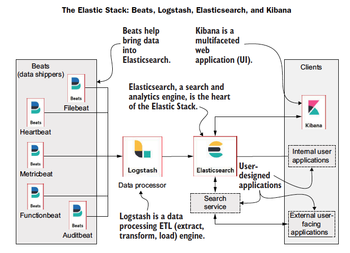

# ELK STACK - ElasticSearch - LogStash - Kibana - Beats 

[ElasticSearch in Action](elasticsearch-in-action.pdf)

**Beats:** port 5044
* The logs need to be shipped to the log processor or the data store which is done by the Beats agents installed on
        machines.
* Beats can transfer logs to logstash or directly to the elasticsearch.
* There are many kinds of beats we can choose based on our log format.
* File Beats are most used among all the available.
* It is suitable for API logs, web apps, and any file with readable lines.

**LogStash:** 
* [The processor] Based on the type of logs, the patterns are defined in Logstash pipelines and the raw lines
                  are converted into json objects.
* On the receiving end, we need logstash to process the raw log entries that were shipped.
* LogStash helps us to create pipelines to facilitate this transformation from raw logs to processed 
  Json objects using specific patterns to filter out the elements from log entries.
* In this tutorial, we will be using Grok patterns to facilitate this transformation.
* We need to install Java before processing the logs.
* We need to create separate pipelines files under the config folder for each log format with the pattern to be 
  filtered and input and output addresses.
* We also need to list the pipelines in the pipelines.yaml.
  Pipelines listed in this file will only be considered as active.

**ElasticSearch:** The processed logs are stored as documents under indices. port 9200
* It is an open-source full text search and analytics engine that is extremely scalable and enables us to swiftly store,
  explore, and analyze large amounts of data in real-time.

**Steps to resolve the issues**
* uncomment the host port and host address in config/*.yml file
* Allow the inbound traffic from port 5044

**kibana:** Runs on top of an ElasticSearch service and visualizes the indices present in the elasticsearch. port **5601**

* Allow inbound traffic from port 9200

######################################################################################

**ELK tutorial with sample log file:** https://www.datawrangler.in/blog/14-elk-stack/

#######################################################################################

* To increase the vm.max_map_count
* sysctl -w vm.max_map_count=262144
